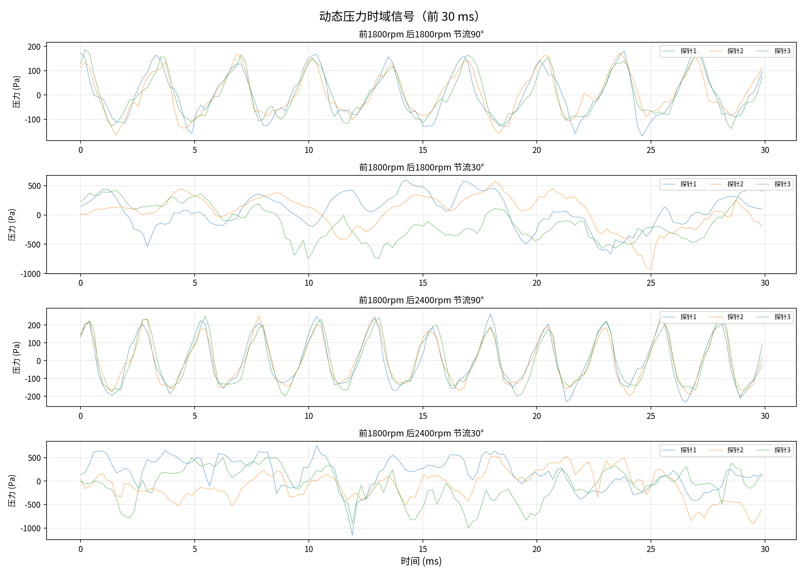
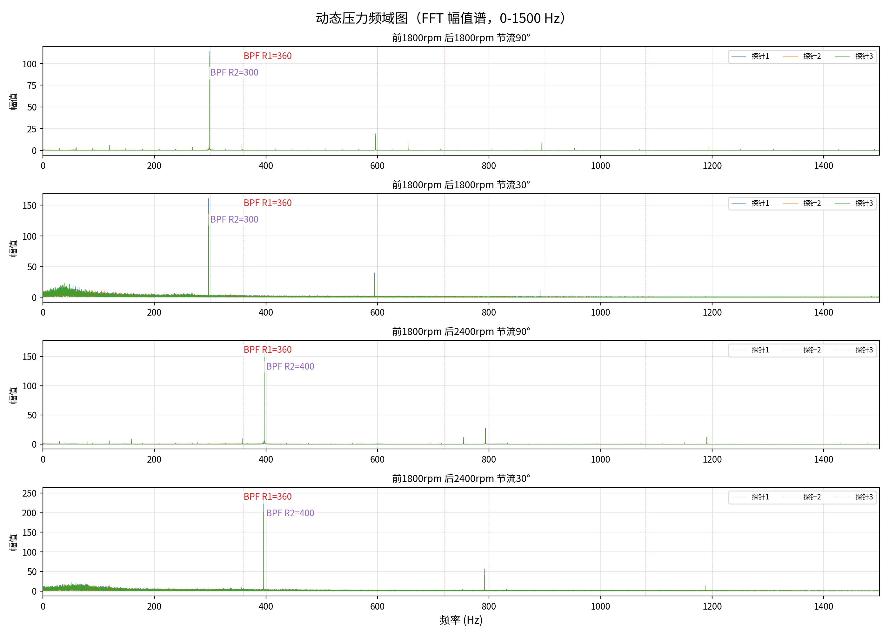

# 发动机动态压力测量实验报告

## 实验条件

| 参数 | 值 |
|------|-----|
| 采样频率 | 5120 Hz | 上游转子叶片数 (R1) | 12 | 下游转子叶片数 (R2) | 10 |
| 探针数量 | 3 (周向布置于下游转子进口) |

## 前1800rpm 后1800rpm 节流90°

| 参数 | 值 |
|------|-----|
| 数据点数 | 128512 | 时长 | 25.10 s |
| BPF R1 (上游) | 360 Hz | BPF R2 (下游) | 300 Hz |

| 通道 | RMS (Pa) | 峰峰值 (Pa) |
|------|----------|-------------|
| ch1 | 96.1 | 497.5 |
| ch2 | 84.5 | 558.5 |
| ch3 | 91.8 | 479.9 |

## 前1800rpm 后1800rpm 节流30°

| 参数 | 值 |
|------|-----|
| 数据点数 | 128512 | 时长 | 25.10 s |
| BPF R1 (上游) | 360 Hz | BPF R2 (下游) | 300 Hz |

| 通道 | RMS (Pa) | 峰峰值 (Pa) |
|------|----------|-------------|
| ch1 | 289.1 | 3440.2 |
| ch2 | 266.5 | 3320.2 |
| ch3 | 284.0 | 3118.6 |

## 前1800rpm 后2400rpm 节流90°

| 参数 | 值 |
|------|-----|
| 数据点数 | 128512 | 时长 | 25.10 s |
| BPF R1 (上游) | 360 Hz | BPF R2 (下游) | 400 Hz |

| 通道 | RMS (Pa) | 峰峰值 (Pa) |
|------|----------|-------------|
| ch1 | 135.3 | 632.6 |
| ch2 | 128.0 | 605.1 |
| ch3 | 133.6 | 617.9 |

## 前1800rpm 后2400rpm 节流30°

| 参数 | 值 |
|------|-----|
| 数据点数 | 128512 | 时长 | 25.10 s |
| BPF R1 (上游) | 360 Hz | BPF R2 (下游) | 400 Hz |

| 通道 | RMS (Pa) | 峰峰值 (Pa) |
|------|----------|-------------|
| ch1 | 374.2 | 3777.9 |
| ch2 | 334.6 | 3521.0 |
| ch3 | 351.4 | 3552.7 |

## 时域信号

## 频域信号

## 分析

1. 节流30°（近失速）工况的压力脉动显著强于节流90°（全开）工况，RMS和峰峰值均高数倍。
2. 四组工况时域信号均呈现周期性脉动，频率与BPF一致。
3. 1800-1800组BPF: R1=360Hz, R2=300Hz；1800-2400组: R1=360Hz, R2=400Hz。
4. FFT频谱可清晰分辨R1和R2的BPF及其谐波，近失速工况下宽带噪声底板明显抬高。